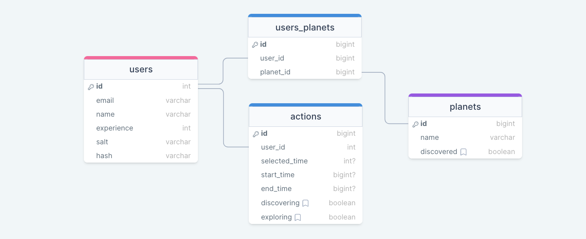

# The Study Planet REST API

> This is the REST API for the Study Planet project. It is built using Node.js, Express.js, and uses a MySQL database.

The API is online available at [sp.qwict.com/api](https://sp.qwict.com/api/v1/health/version).

## Database Model

The database model is available at [drawsql.app/qwict/studyplanetdatabase](https://drawsql.app/teams/qwict/diagrams/studyplanetdatabase)

